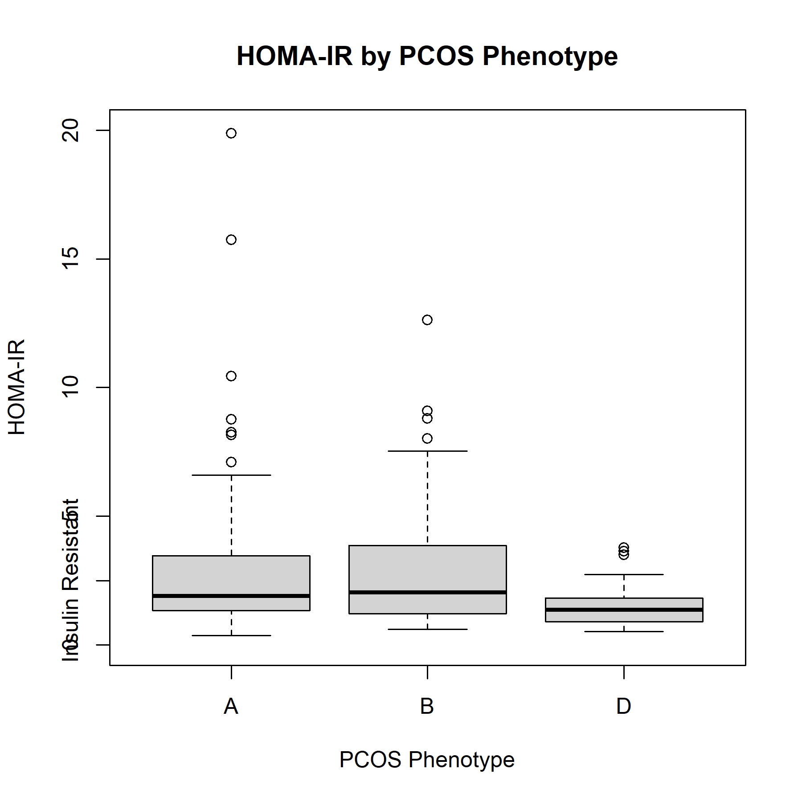

```{r, load-data, echo=FALSE, message=FALSE}
here::i_am("MP_project_4.Rmd")
data <- readRDS(
  file = here::here("output/data_clean.rds")
)
```

### Introduction
This dataset (https://dataverse.harvard.edu/dataset.xhtml?persistentId=doi:10.7910/DVN/ZFSUOO) includes ovarian function measures in normogonadotropic anovulation and subclinical hypothyroidism from a prospective open-label cohort study. This analysis reports on __HOMA-IR__ (homeostatic model for insulin resistance) by different phenotypes of __PCOS__ (polycystic ovary syndrome).
```{r, assign-var, echo=FALSE}
pheno_a <- "biochemical and/or clinical hyperandrogenism (increased testosterone serum level or FAI > 5) + irregular menstrual cycles + PCOM"
pheno_b <- "hyperandrogenism (increased testosterone serum level or FAI > 5) + irregular menstrual cycles"
pheno_d <- "irregular menstrual cycles + PCOM"
```

### Table One
Characteristics of the `r nrow(df)` participants are displayed in the table below.
Phenotypes are defined as follows:

* A: `r pheno_a`
* B: `r pheno_b`
* D: `r pheno_d`

```{r, table-1, echo=FALSE}
table_one <- readRDS(
  file = here::here("output/table_one.rds")
)
table_one
```


### Boxplot
In this analysis, we generated a boxplot of phenotypes of PCOS diagnosis against HOMA-IR. A value of HOMA-IR greater than 2.5 indicates concern for insulin resistance.

```{r,boxplot, echo=FALSE}


```